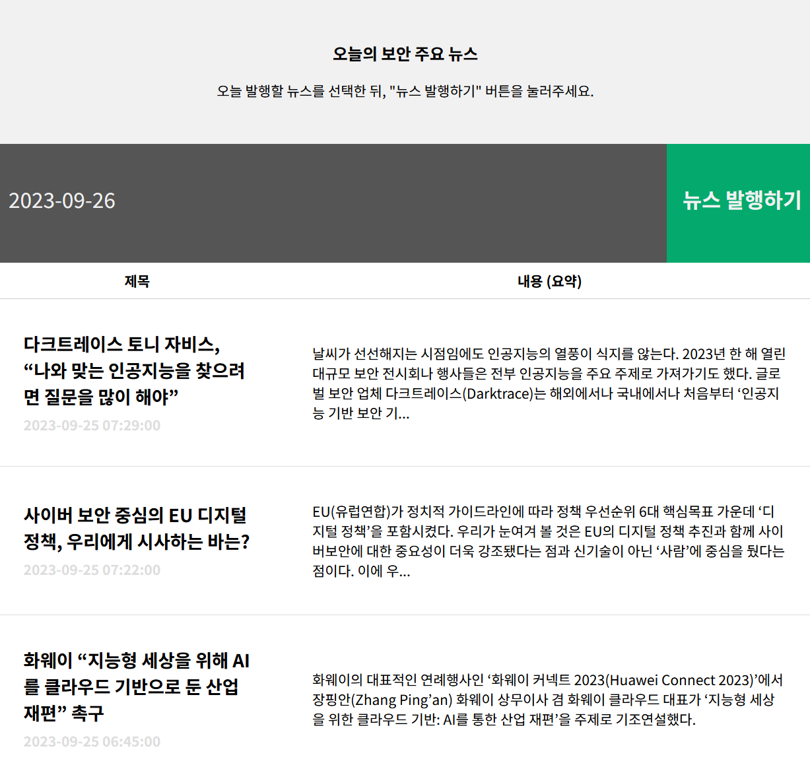

# News Crawler

## 📌 Introduce
정보보안보안 뉴스를 크롤링하는 프로그램 입니다.

## 📅 Development period
2021.02 ~ 2022.08

## ✨ Features
- [Google 알리미](https://www.google.co.kr/alerts) 크롤링
- RSS feed Parse 가능 - [보안뉴스](http://www.boannews.com/media/news_rss.xml) 및 [데일리시큐](https://www.dailysecu.com/rss/allArticle.xml) 파싱 중
- [Naver API](https://developers.naver.com/apps/#/list) 등록 후 네이버 검색 결과 크롤링 가능


---

## 👨‍🔧 install

### 1. requirements 설치

``` bash
# 가상환경 생성
python -m venv venv
source venv/bin/activate

# 일반 사용
pip install -r requirements/prod.txt

# 개발 및 기여용
pip install -r requirements/dev.txt
```

### 2. Naver API 키 등록

Naver API 검색 기능을 이용하기 위해, [Naver API 키 등록](https://developers.naver.com/apps/#/list)이 필요합니다.

API를 받으셨다면, 아래와 같은 명령어로 `naverapi.key` 파일을 생성해야 합니다 

** 참고 : `[ ]` 는 제외하여 입력 필요**

``` bash
echo "[Client ID 값 입력].[Client Secret 값 입력]" >  naverapi.key
```

---

## 🔎 How to Use

``` bash
python main.py
```

## 📝 Result

`pages` 디렉토리에 `index.html` 파일이 생성되고, 아래와 같이 크롤링 결과를 확인할 수 있습니다.




